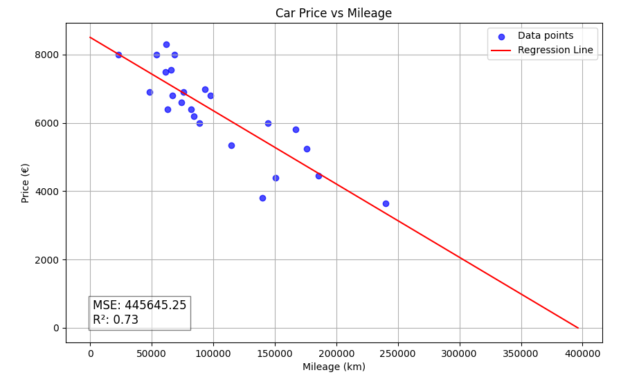

# ft_linear_regression: An Introduction to Machine Learning

Este proyecto es una introducción a los conceptos básicos del Machine Learning. El objetivo es implementar un algoritmo de regresión lineal simple desde cero para predecir el precio de un coche basándose en su kilometraje.

## 📜 Descripción

El programa utiliza un modelo de regresión lineal entrenado con el algoritmo de descenso de gradiente. Se divide en dos partes principales: un script para entrenar el modelo con un conjunto de datos y otro para predecir el precio de un coche dado su kilometraje.

### Características
- **Entrenamiento del Modelo**: Entrena un modelo de regresión lineal y guarda los parámetros (`θ0` y `θ1`).
- **Predicción de Precios**: Utiliza el modelo entrenado para estimar el precio de un coche.
- **Visualización de Datos (Bonus)**: Muestra un gráfico de dispersión de los datos junto con la línea de regresión del modelo.
- **Cálculo de Precisión (Bonus)**: Calcula y muestra el Error Cuadrático Medio (MSE) y el Coeficiente de Determinación (R²) para evaluar la precisión del modelo.

## 🛠️ Instalación y Configuración

Para ejecutar este proyecto, necesitarás Python 3. Se recomienda utilizar un entorno virtual.

1.  **Clona el repositorio:**
    ```bash
    git clone https://github.com/XabierMatute/ft_linear_regression
    cd ft_linear_regression
    ```

2.  **Crea y activa un entorno virtual:**
    ```bash
    python3 -m venv venv
    source venv/bin/activate
    ```

3.  **Instala las dependencias:**
    El proyecto utiliza `pandas` para la manipulación de datos y `matplotlib` para la visualización.
    ```bash
    pip install -r requirement.txt
    ```

## 🚀 Uso

El proyecto consta de tres scripts principales.

### 1. Entrenar el Modelo

El script `train.py` lee los datos de `data/data.csv`, entrena el modelo de regresión lineal y guarda los parámetros `theta0` y `theta1` en `model.csv`.

```bash
python3 train.py
```
Puedes pasar opcionalmente la ruta al fichero de datos:
```bash
python3 train.py data/data2.csv
```

### 2. Predecir un Precio

Una vez que el modelo ha sido entrenado, puedes usar `predict.py` para estimar el precio de un coche. El script te pedirá que introduzcas un kilometraje.

```bash
python3 predict.py
```
**Ejemplo de ejecución:**
```
Please enter a mileage: 22000
For a mileage of 22000.0 km, the estimated price is: 7890.12€
```

### 3. Visualizar los Datos y la Precisión (Bonus)

El script `plot_bonus.py` muestra un gráfico con los datos del CSV, la línea de regresión del modelo y las métricas de precisión (MSE y R²).

```bash
python3 plot_bonus.py
```
Esto abrirá una ventana con un gráfico similar a este:



## 🧠 Conceptos Implementados

### Hipótesis Lineal
El modelo utiliza la siguiente función para predecir el precio:
`estimatePrice(mileage) = θ₀ + (θ₁ * mileage)`

### Descenso de Gradiente
Para encontrar los valores óptimos de `θ₀` y `θ₁`, se utiliza el algoritmo de descenso de gradiente, que minimiza el error entre las predicciones y los valores reales.

### Normalización de Datos
Las características (kilometraje y precio) se normalizan a una escala común (generalmente [0, 1]) antes del entrenamiento. Esto es crucial para que el descenso de gradiente converja de manera eficiente y estable, especialmente cuando las características tienen rangos muy diferentes. Una vez finalizado el entrenamiento, los parámetros se denormalizan para poder usarlos con los datos originales.